## Plan de Pruebas

**1. Resumen**

* **Nombre del proyecto:** MyFood/Inventory
* **Versión del software:** v.1.0.1
* **Fecha de inicio:** 01/10/2024
* **Fecha de finalización:** 26/10/2024
* **Equipo de pruebas:** Santiago Benitez Lopez sbenitez1607@gmail.com www.github.com/SBenitezL

**2. Objetivo**

* Comprobar el correcto funcionamiento de los endpoints de la aplicación
* Realizar pruebas en los valores límites, caminos ideales, y valores fuera de rango.

**3. Alcance**

* Se probarán los servicios reistrados en http://localhost:8080/swagger-ui/index.html
  >  [!NOTE]
  >  Para acceder a la información del link es necesario lanzar el aplicativo.
* Se realizaran pruebas de Postman.

**4. Entorno de pruebas**

* Instalar la aplicación de PostMan Desktop o extención en VsCode.
* Crear un paquete llamado MyFood
* Anidar en el paquete "MyFood" un paquete llamado "Inventory"
* Crear dentro del paquete "Inventory" un pquete por cada método a probar.

**5. Casos de prueba**

* **Test 01 - Crear un producto con datos correctos:** 
* **Descripción:** Se enviará una petición con los datos necesarios para que se cree exitosamente el producto.
* **Precondiciones:** Base de datos limpia. 
* **Pasos:** 
  1. Crear una petición.
  2. Elegir el método POST.
  3. Ingresar el endpoint a probar (/api/v1/products)

> [!NOTE]
> Por defecto la aplicación se ejecuta en http://localhost:8080

  4. Rellenar el Json con los datos apropiados para que se cree exitosamente el producto, por ejemplo:
     ```json
      {
        "name": "Papa",
        "stock": 0,
        "category": "FRUITS",
        "units": "POUNDS",
        "usefulLife": "2024-10-31"
      }

* **Resultados esperados:** 
  1. Status code: 201 CREATED
  2. Body: 
     ```json
      {
        "id": "1d4a4d6e-c418-4a7e-9b59-209f6583d706"(Puede variar),
        "name": "Papa",
        "stock": 0.0,
        "category": "LEGUMES",
        "units": "POUNDS",
        "usefulLife": "2024-10-30",
        "expired": false
      }

* **Resultados reales:** 

  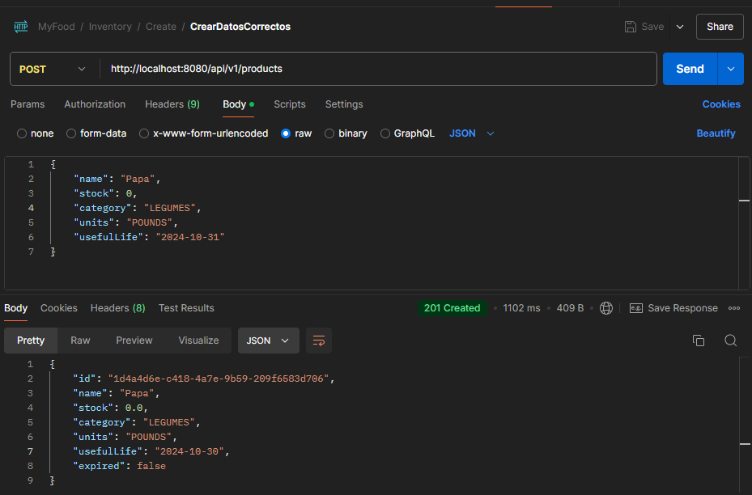 

* **Estado:** Aprobado


* **Test 02 - Crear un producto con un nombre ya registrado:** 
* **Descripción:** Se enviará una petición con los datos de un producto cuyo nombre ya se encuentra registrado.
* **Precondiciones:** Haber ejecutado exitosamente el Test 01.
* **Pasos:** 
  1. Crear una petición.
  2. Elegir el método POST.
  3. Ingresar el endpoint a probar (/api/v1/products)

>  [!NOTE]
>  Por defecto la aplicación se ejecuta en http://localhost:8080

  4. Rellenar el Json con los datos apropiados para que se cree exitosamente el producto, por ejemplo:
     ```json
      {
        "name": "Papa",
        "stock": 0,
        "category": "FRUITS",
        "units": "POUNDS",
        "usefulLife": "2024-11-28"
      }

* **Resultados esperados:** 
  1. Status code: 409 CONFLICT
  2. Body: 
     ```json
      {
        "errorCode": "GC-0009",
        "message": "ERROR, ENTITY ALREADY EXISTS, The product with name: Papaalready exist in the system.",
        "httpCode": 409,
        "url": "http://localhost:8080/api/v1/products",
        "method": "POST"
      }

* **Resultados reales:** 

  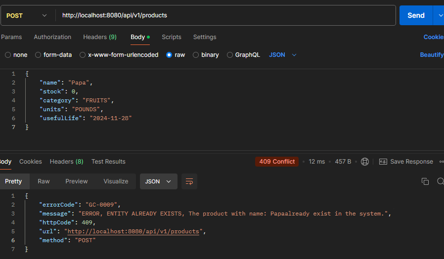 


* **Estado:** Aprobado
* **Test 03 - Crear un producto con un nombre vacio:** 
* **Descripción:** Se enviará una petición con los datos de un producto sin nombre.
* **Precondiciones:** Ninguna.
* **Pasos:** 
  1. Crear una petición.
  2. Elegir el método POST.
  3. Ingresar el endpoint a probar (/api/v1/products)

> [!NOTE]
> Por defecto la aplicación se ejecuta en http://localhost:8080

  4. Rellenar el Json con los datos apropiados para que se cree exitosamente el producto, por ejemplo:
     ```json
      {
        "name": "",
        "stock": 0,
        "category": "FRUITS",
        "units": "POUNDS",
        "usefulLife": "2024-11-28"
      }
* **Resultados esperados:** 
  1. Status code: 400 BAD REQUEST
  2. Body: 
     ```json
      {
        "errorCode": "GC-0007",
        "message": "ERROR, BAD FORMAT, The name of the product can't be blank",
        "httpCode": 400,
        "url": "http://localhost:8080/api/v1/products",
        "method": "POST"
      }
* **Resultados reales:** 

  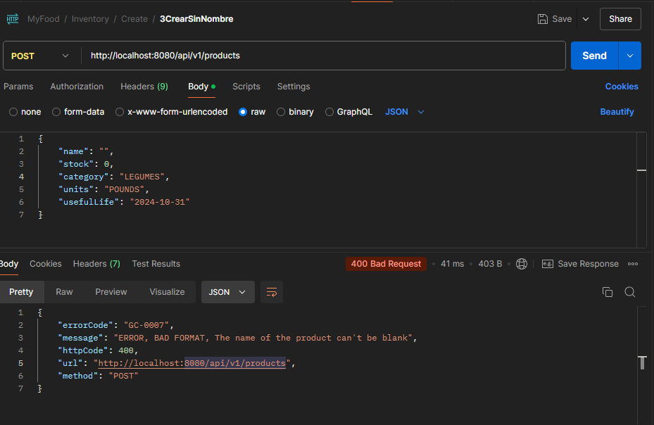 


* **Estado:** Aprobado

* **Test 04 - Crear un producto con stock negativo:** 
* **Descripción:** Se enviará una petición con los datos de un producto con un valor negativo en stock.
* **Precondiciones:** Ninguna.
* **Pasos:** 
  1. Crear una petición.
  2. Elegir el método POST.
  3. Ingresar el endpoint a probar (/api/v1/products)

> [!NOTE]
> Por defecto la aplicación se ejecuta en http://localhost:8080

  4. Rellenar el Json con los datos apropiados para que se cree exitosamente el producto, por ejemplo:
     ```json
      {
        "name": "Banano",
        "stock": -1,
        "category": "FRUITS",
        "units": "POUNDS",
        "usefulLife": "2024-11-28"
      }
* **Resultados esperados:** 
  1. Status code: 400 BAD REQUEST
  2. Body: 
     ```json
      {
        "errorCode": "GC-0007",
        "message": "ERROR, BAD FORMAT, The stock can't be negative",
        "httpCode": 400,
        "url": "http://localhost:8080/api/v1/products",
        "method": "POST"
      }
* **Resultados reales:** 

  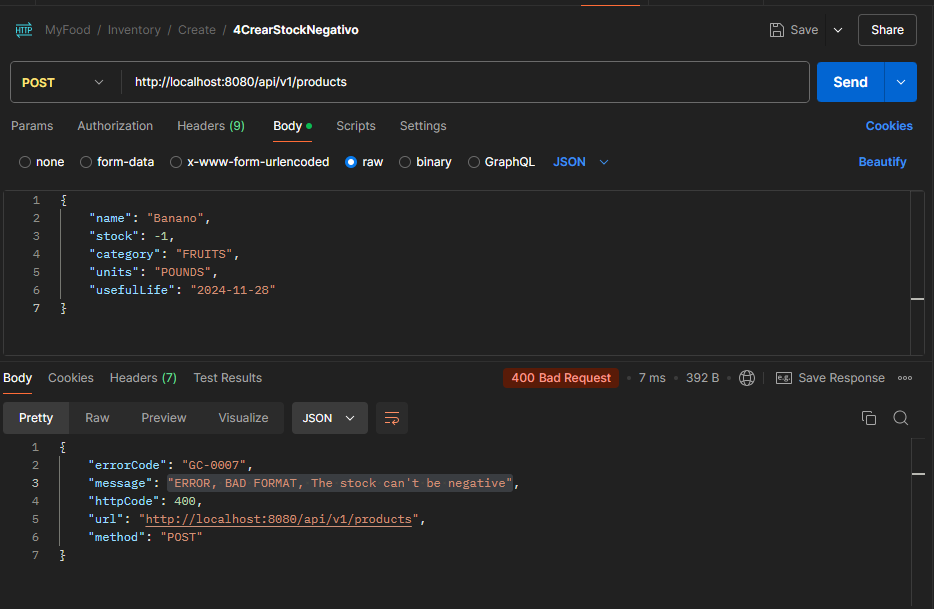 


* **Estado:** Aprobado

* **Test 05 - Crear un producto sin categoría:** 
* **Descripción:** Se enviará una petición con los datos de un producto sin categoría.
* **Precondiciones:** Ninguna.
* **Pasos:** 
  1. Crear una petición.
  2. Elegir el método POST.
  3. Ingresar el endpoint a probar (/api/v1/products)

> [!NOTE]
> Por defecto la aplicación se ejecuta en http://localhost:8080

  4. Rellenar el Json con los datos apropiados para que se cree exitosamente el producto, por ejemplo:
     ```json
      {
        "name": "Sandia",
        "stock": 0,
        "category": "",
        "units": "POUNDS",
        "usefulLife": "2024-11-28"
      }
* **Resultados esperados:** 
  1. Status code: 406 NOT ACCEPTABLE
  2. Body: 
     ```json
      {
        "errorCode": "GC-0007",
        "message": "ERROR, BAD FORMAT, The values accepted are: FRUITS VEGETABLES DAIRY MEAT SEAFOOD GRAINS BEVERAGES SWEETS SNACKS CONDIMENTS LEGUMES NUTS_AND_SEEDS ",
        "httpCode": 406,
        "url": "http://localhost:8080/api/v1/products",
        "method": "POST"
      }
* **Resultados reales:** 

  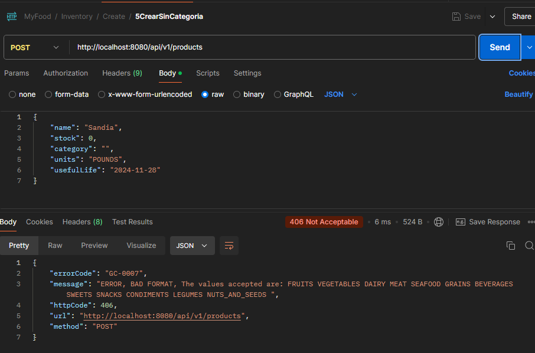 


* **Estado:** Aprobado

* **Test 06 - Crear un producto con categoría invalida:** 
* **Descripción:** Se enviará una petición con los datos de un producto con una categoría que no existe.
* **Precondiciones:** Ninguna.
* **Pasos:** 
  1. Crear una petición.
  2. Elegir el método POST.
  3. Ingresar el endpoint a probar (/api/v1/products)

> [!NOTE]
> Por defecto la aplicación se ejecuta en http://localhost:8080

  4. Rellenar el Json con los datos apropiados para que se cree exitosamente el producto, por ejemplo:
     ```json
      {
        "name": "Sandia",
        "stock": 0,
        "category": "FRUTA",
        "units": "POUNDS",
        "usefulLife": "2024-11-28"
      }
* **Resultados esperados:** 
  1. Status code: 406 NOT ACCEPTABLE
  2. Body: 
     ```json
      {
        "errorCode": "GC-0007",
        "message": "ERROR, BAD FORMAT, The values accepted are: FRUITS VEGETABLES DAIRY MEAT SEAFOOD GRAINS BEVERAGES SWEETS SNACKS CONDIMENTS LEGUMES NUTS_AND_SEEDS ",
        "httpCode": 406,
        "url": "http://localhost:8080/api/v1/products",
        "method": "POST"
      }
* **Resultados reales:**

  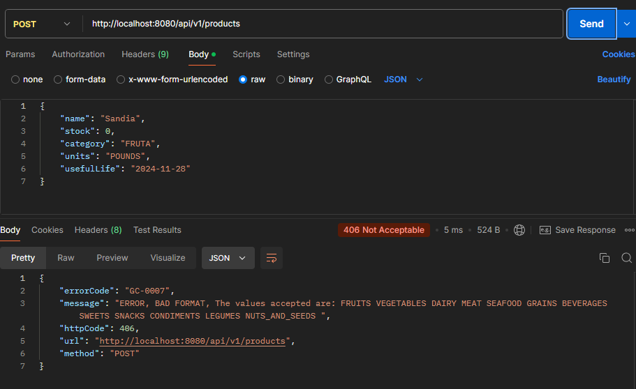 


* **Estado:** Aprobado

* **Test 07 - Crear un producto sin unidades:** 
* **Descripción:** Se enviará una petición con los datos de un producto sin unidades.
* **Precondiciones:** Ninguna.
* **Pasos:** 
  1. Crear una petición.
  2. Elegir el método POST.
  3. Ingresar el endpoint a probar (/api/v1/products)

> [!NOTE]
> Por defecto la aplicación se ejecuta en http://localhost:8080

  4. Rellenar el Json con los datos apropiados para que se cree exitosamente el producto, por ejemplo:
     ```json
      {
        "name": "Sandia",
        "stock": 0,
        "category": "FRUTA",
        "units": "",
        "usefulLife": "2024-11-28"
      }
* **Resultados esperados:** 
  1. Status code: 406 NOT ACCEPTABLE
  2. Body: 
     ```json
      {
        "errorCode": "GC-0007",
        "message": "ERROR, BAD FORMAT, The values accepted are: MILLILITERS LITERS CUPS TEASPOONS TABLESPOONS FLUID_OUNCES GRAMS KILOGRAMS OUNCES POUNDS PIECES SLICES SERVINGS ",
        "httpCode": 406,
        "url": "http://localhost:8080/api/v1/products",
        "method": "POST"
      }
* **Resultados reales:**

  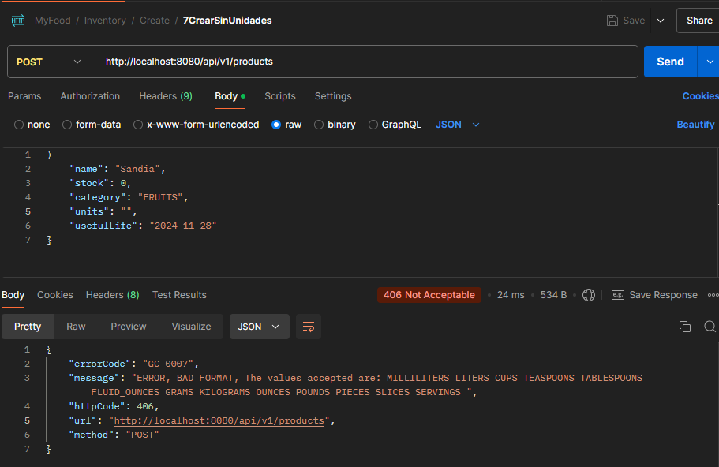 


* **Estado:** Aprobado

* **Test 08 - Crear un producto sin fecha de vencimiento:** 
* **Descripción:** Se enviará una petición con los datos de un producto sin fecha de vencimiento.
* **Precondiciones:** Ninguna.
* **Pasos:** 
  1. Crear una petición.
  2. Elegir el método POST.
  3. Ingresar el endpoint a probar (/api/v1/products)

> [!NOTE]
> Por defecto la aplicación se ejecuta en http://localhost:8080

  4. Rellenar el Json con los datos apropiados para que se cree exitosamente el producto, por ejemplo:
     ```json
      {
        "name": "Sandia",
        "stock": 0,
        "category": "FRUITS",
        "units": "",
        "usefulLife": ""
      }
* **Resultados esperados:** 
  1. Status code: 201 CREATED
  2. Body: 
     ```json
      {
        "id": "07d22c50-4c4c-46d4-8f15-a834d9c33eaf",
        "name": "Sandia",
        "stock": 0.0,
        "category": "FRUITS",
        "units": "POUNDS",
        "usefulLife": null,
        "expired": false
      }
* **Resultados reales:**

  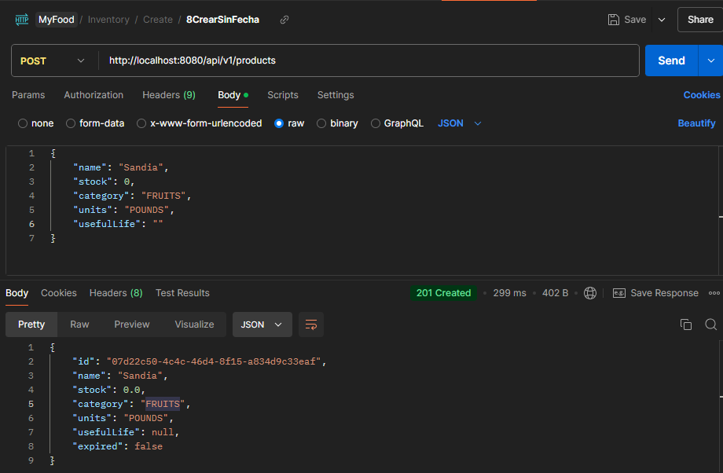 


* **Estado:** Aprobado

* **Test 09 - Crear un producto con fecha pasada:** 
* **Descripción:** Se enviará una petición con los datos de un producto con una fecha que ya pasó.
* **Precondiciones:** Ninguna.
* **Pasos:** 
  1. Crear una petición.
  2. Elegir el método POST.
  3. Ingresar el endpoint a probar (/api/v1/products)

> [!NOTE]
> Por defecto la aplicación se ejecuta en http://localhost:8080

  4. Rellenar el Json con los datos apropiados para que se cree exitosamente el producto, por ejemplo:
     ```json
      {
        "name": "Manzana",
        "stock": 0,
        "category": "FRUITS",
        "units": "POUNDS",
        "usefulLife": "2024-07-24"
      }
* **Resultados esperados:** 
  1. Status code: 406 NOT ACCEPTABLE
  2. Body: 
     ```json
      {
        "errorCode": "GC-0004",
        "message": "ERROR, BUSINESS RULE HAS BEEN VIOLATED, Can't save products expired.",
        "httpCode": 406,
        "url": "http://localhost:8080/api/v1/products",
        "method": "POST"
      }
* **Resultados reales:** 

  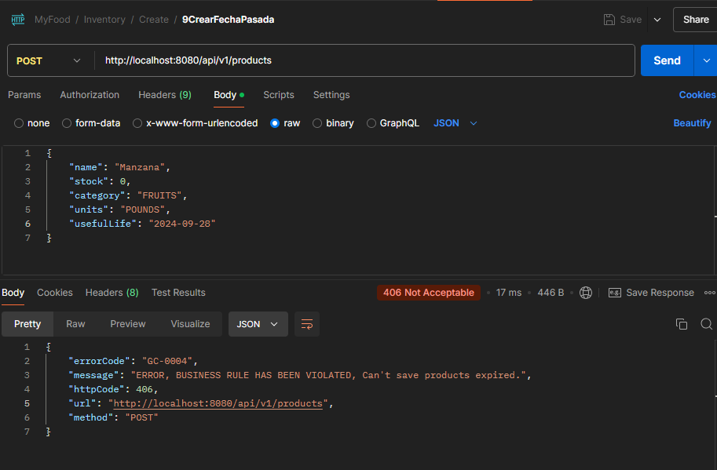 


* **Estado:** Aprobado

* **Test 010 - Consultar todos los productos con inventario vacio:** 
* **Descripción:** Se enviará una petición para recuperar toda la información del inventario mientras no sa ha registrado ningun producto.
* **Precondiciones:** Sistema vacio
* **Pasos:** 
  1. Crear una petición.
  2. Elegir el método GET.
  3. Ingresar el endpoint a probar (/api/v1/products)

> [!NOTE]
> Por defecto la aplicación se ejecuta en http://localhost:8080

* **Resultados esperados:** 
  1. Status code: 404 NOT FOUND
  2. Body: 
     ```json
      {
        "errorCode": "GC-0005",
        "message": "ERROR, NO DATA, There is no information recorded in the inventory.",
        "httpCode": 404,
        "url": "http://localhost:8080/api/v1/products/",
        "method": "GET"
      }
* **Resultados reales:** 

  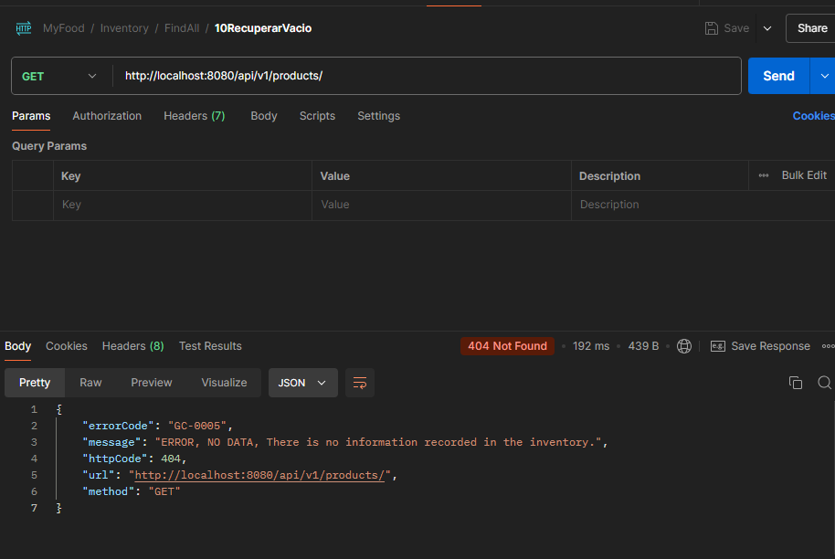 


* **Estado:** Aprobado

* **Test 011 - Consultar todos los productos con 1 producto registrado:** 
* **Descripción:** Se enviará una petición para recuperar toda la información del inventario cuando solo se ha registrado 1 producto.
* **Precondiciones:** Haber ingresado un producto correctamente.
* **Pasos:** 
  1. Crear una petición.
  2. Elegir el método GET.
  3. Ingresar el endpoint a probar (/api/v1/products)

> [!NOTE]
> Por defecto la aplicación se ejecuta en http://localhost:8080

* **Resultados esperados:** 
  1. Status code: 200 OK
  2. Body: 
     ```json
      [
        {
          "id": "8b50ad68-3e26-43f9-a200-8748c8045de9",
          "name": "Papa",
          "stock": 0.0,
          "category": "LEGUMES",
          "units": "POUNDS",
          "usefulLife": "2024-10-30",
          "expired": false
        }
      ]
* **Resultados reales:** 

  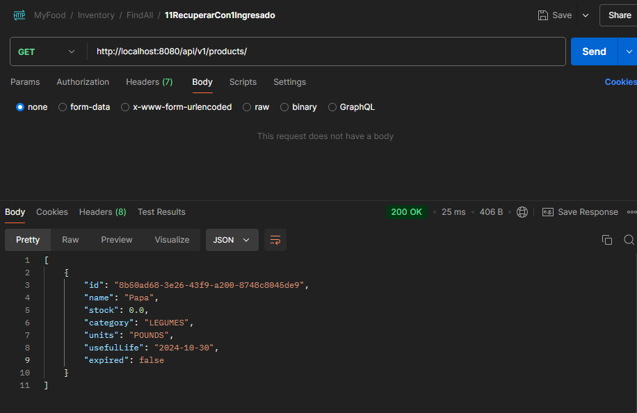 


* **Estado:** Aprobado

* **Test 012 - Consultar todos los productos con mas de 1 producto registrado:** 
* **Descripción:** Se enviará una petición para recuperar toda la información del inventario cuando solo se ha registrado mas de 1 producto.
* **Precondiciones:** Haber ingresado varios productos correctamente.
* **Pasos:** 
  1. Crear una petición.
  2. Elegir el método GET.
  3. Ingresar el endpoint a probar (/api/v1/products)

> [!NOTE]
> Por defecto la aplicación se ejecuta en http://localhost:8080

* **Resultados esperados:** 
  1. Status code: 200 OK
  2. Body: 
     ```json
      [
        {
          "id": "2557b53b-460a-45e0-94cd-6efd02f41bff",
          "name": "Sandia",
          "stock": 0.0,
          "category": "FRUITS",
          "units": "POUNDS",
          "usefulLife": "2024-11-27",
          "expired": false
        },
        {
          "id": "8b50ad68-3e26-43f9-a200-8748c8045de9",
          "name": "Papa",
          "stock": 0.0,
          "category": "LEGUMES",
          "units": "POUNDS",
          "usefulLife": "2024-10-30",
          "expired": false
        }
      ]
* **Resultados reales:** 

  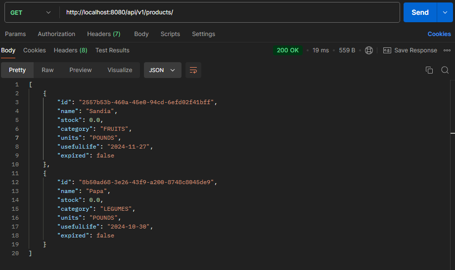 


* **Estado:** Aprobado

* **Test 013 - Actualizar un producto existente:** 
* **Descripción:** Se enviará una petición para actualizar un producto que ya existe
* **Precondiciones:** Haber ingresado al menos un producto correctamente.
* **Pasos:** 
  1. Crear una petición.
  2. Elegir el método GET.
  3. Ingresar el endpoint a probar (/api/v1/products)
 
> [!NOTE]
> Por defecto la aplicación se ejecuta en http://localhost:8080

  4. Rellenear el Body con la nueva información
 ```json
     {
        "id": "236ee3fd-7e22-4500-a899-a79a439e1564",
        "name": "Papaya",
        "stock": 14,
        "category": "FRUITS",
        "units": "POUNDS",
        "usefulLife": "2024-11-01"
      }

* **Resultados esperados:** 
  1. Status code: 200 OK
  2. Body: 
     ```json
      {
        "id": "236ee3fd-7e22-4500-a899-a79a439e1564",
        "name": "Papaya",
        "stock": 14.0,
        "category": "FRUITS",
        "units": "POUNDS",
        "usefulLife": "2024-10-31",
        "expired": false
      }

* **Resultados reales:** 

   


* **Estado:** Aprobado


* **Test 014 - Actualizar un producto no existente:** 
* **Descripción:** Se enviará una petición para actualizar un producto que no existe
* **Precondiciones:** Ninguna
* **Pasos:** 
  1. Crear una petición.
  2. Elegir el método GET.
  3. Ingresar el endpoint a probar (/api/v1/products)
 
> [!NOTE]
> Por defecto la aplicación se ejecuta en http://localhost:8080

  4. Rellenear el Body con la nueva información
 ```json
     {
        "id": "estenoexiste",
        "name": "Banano",
        "stock": 3,
        "category": "FRUITS",
        "units": "POUNDS",
        "usefulLife": "2024-11-01"
      }

* **Resultados esperados:** 
  1. Status code: 404 NOT FOUND
  2. Body: 
     ```json
      {
        "errorCode": "GC-0008",
        "message": "ERROR, COULDN'T FOUND ENTITY, The product with id: estenoexiste is not registered in the inventory.",
        "httpCode": 404,
        "url": "http://localhost:8080/api/v1/products",
        "method": "PUT"
      }

* **Resultados reales:** 

  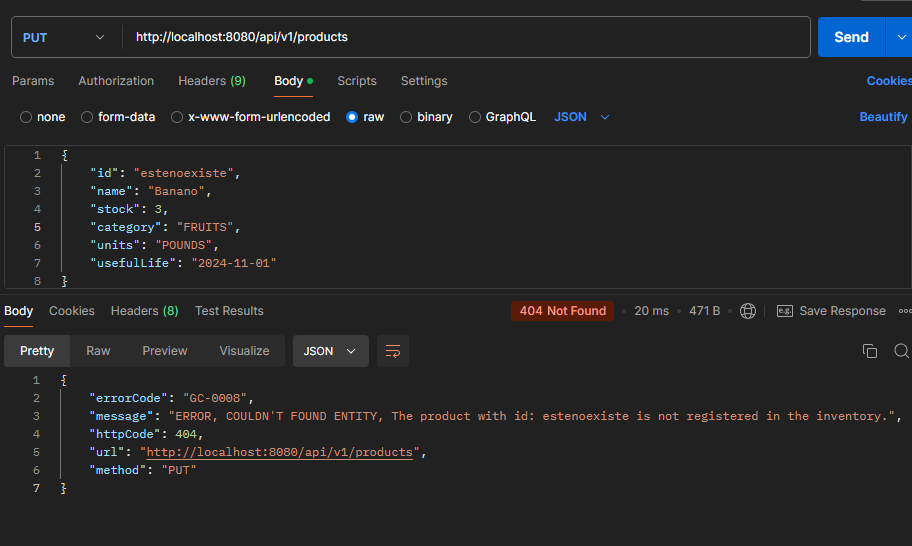 


* **Estado:** Aprobado


* **Test 015 - Actualizar un producto sin nombre:** 
* **Descripción:** Se enviará una petición para actualizar un producto sin agregar el nombre.
* **Precondiciones:** Tener al menos 1 producto registrado
* **Pasos:** 
  1. Crear una petición.
  2. Elegir el método GET.
  3. Ingresar el endpoint a probar (/api/v1/products)
 
> [!NOTE]
> Por defecto la aplicación se ejecuta en http://localhost:8080

  4. Rellenear el Body con la nueva información
 ```json
     {
        "id": "236ee3fd-7e22-4500-a899-a79a439e1564",
        "name": "",
        "stock": 3,
        "category": "FRUITS",
        "units": "POUNDS",
        "usefulLife": "2024-11-01"
      }

* **Resultados esperados:** 
  1. Status code: 400 BAD REQUEST
  2. Body: 
     ```json
      {
        "errorCode": "GC-0007",
        "message": "ERROR, BAD FORMAT, The name of the product can't be blank",
        "httpCode": 400,
        "url": "http://localhost:8080/api/v1/products",
        "method": "PUT"
      }

* **Resultados reales:** 

  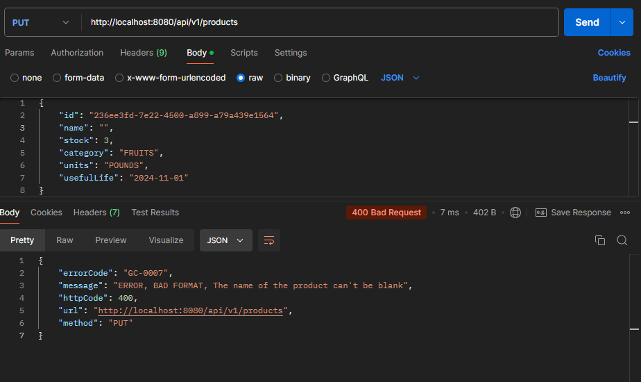 


* **Estado:** Aprobado

* **Test 016 - Actualizar un producto con nombre ya existente:** 
* **Descripción:** Se enviará una petición para actualizar un producto con un nombre que ya pertenece a otro producto
* **Precondiciones:** Tener al menos 2 productos registrados
* **Pasos:** 
  1. Crear una petición.
  2. Elegir el método GET.
  3. Ingresar el endpoint a probar (/api/v1/products)
 
> [!NOTE]
> Por defecto la aplicación se ejecuta en http://localhost:8080

  4. Rellenear el Body con la nueva información
 ```json
     {
        "id": "236ee3fd-7e22-4500-a899-a79a439e1564",
        "name": "Sandia",
        "stock": 3,
        "category": "FRUITS",
        "units": "POUNDS",
        "usefulLife": "2024-11-01"
      }

* **Resultados esperados:** 
  1. Status code: 406 NOT ACCEPTABLE
  2. Body: 
     ```json
      {
        "errorCode": "GC-0007",
        "message": "ERROR, BAD FORMAT, The name of the product can't be blank",
        "httpCode": 400,
        "url": "http://localhost:8080/api/v1/products",
        "method": "PUT"
      }

* **Resultados reales:** 

  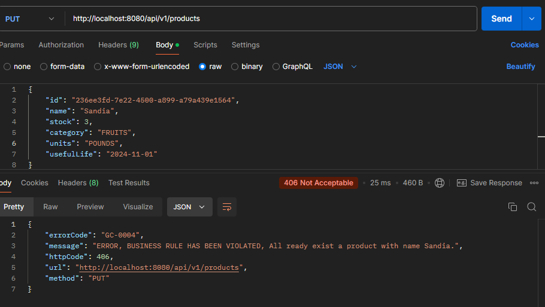 


* **Estado:** Aprobado

* **Test 017 - Actualizar un producto con stock negativo:** 
* **Descripción:** Se enviará una petición para actualizar un producto con un stock negativo.
* **Precondiciones:** Tener al menos 1 producto registrado
* **Pasos:** 
  1. Crear una petición.
  2. Elegir el método GET.
  3. Ingresar el endpoint a probar (/api/v1/products)
 
> [!NOTE]
> Por defecto la aplicación se ejecuta en http://localhost:8080

  4. Rellenear el Body con la nueva información
 ```json
     {
        "id": "236ee3fd-7e22-4500-a899-a79a439e1564",
        "name": "Pera",
        "stock": -3,
        "category": "FRUITS",
        "units": "POUNDS",
        "usefulLife": "2024-11-01"
      }

* **Resultados esperados:** 
  1. Status code: 400 BAD REQUEST
  2. Body: 
     ```json
      {
        "errorCode": "GC-0007",
        "message": "ERROR, BAD FORMAT, The stock can't be negative",
        "httpCode": 400,
        "url": "http://localhost:8080/api/v1/products",
        "method": "PUT"
        }

* **Resultados reales:** 

  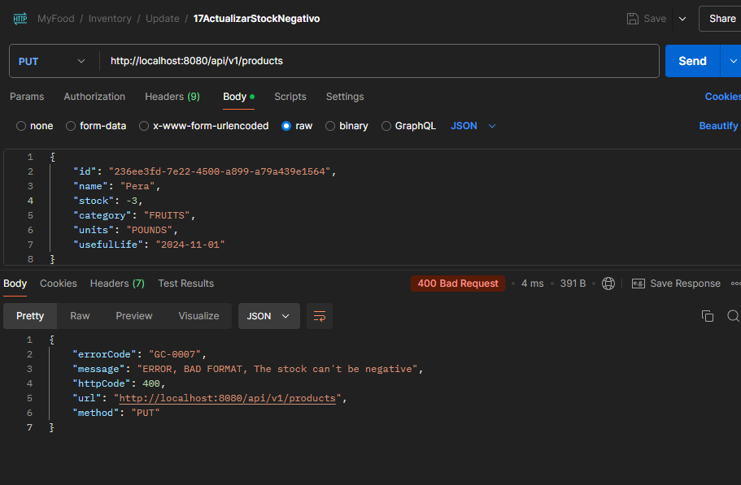 


* **Estado:** Aprobado


**6. Estrategias de prueba**

* Describir las estrategias de prueba que se utilizarán, como pruebas funcionales, de rendimiento, de seguridad, etc.
* Especificar el tipo de pruebas que se realizarán para cada módulo o funcionalidad.

**7. Criterios de aceptación**

* Definir los criterios de aceptación para considerar que las pruebas han sido exitosas.
* Especificar los indicadores clave de rendimiento (KPI) que se utilizarán para evaluar los resultados.

**8. Gestión de riesgos**

* Identificar los riesgos potenciales que pueden afectar las pruebas.
* Describir las estrategias para mitigar los riesgos.

**9. Documentación**

* Especificar los documentos que se generarán durante las pruebas, como informes de errores, registros de pruebas, etc.

**10. Aprobaciones**

* Obtener las aprobaciones necesarias de las partes interesadas para el plan de pruebas.

**11. Apéndice**

* Incluir información adicional relevante, como matrices de trazabilidad, glosario de términos, etc.

**Recuerda:** Esta plantilla es un punto de partida. Adapta las secciones y el contenido a las necesidades específicas de tu proyecto.
